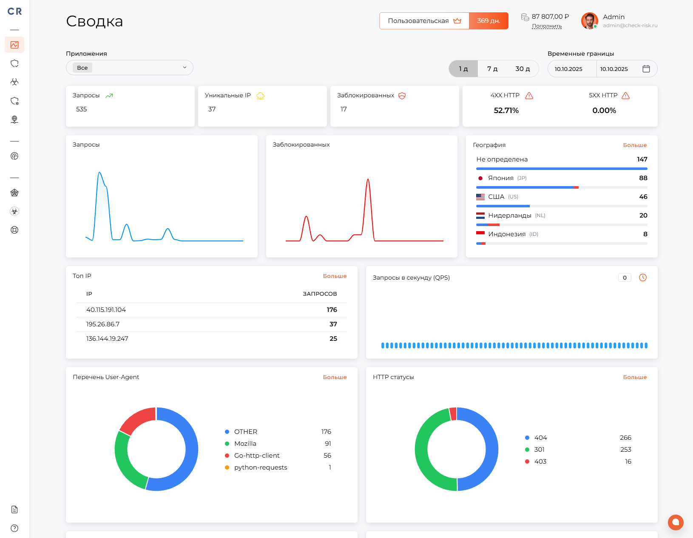
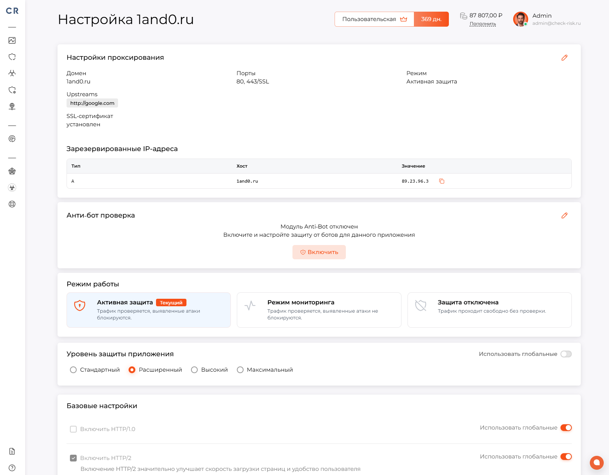
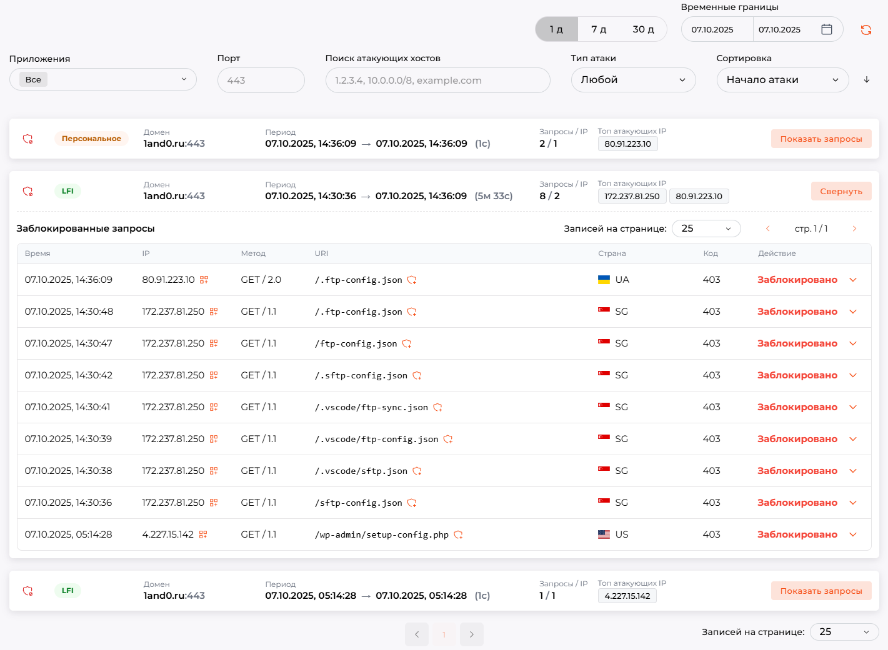
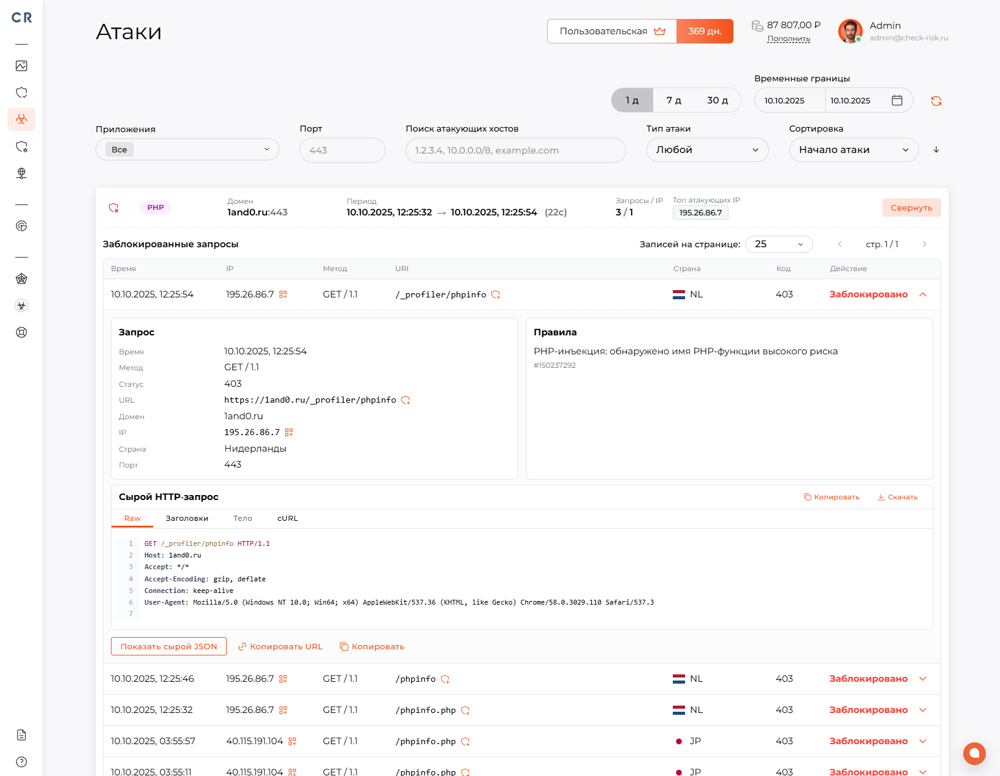
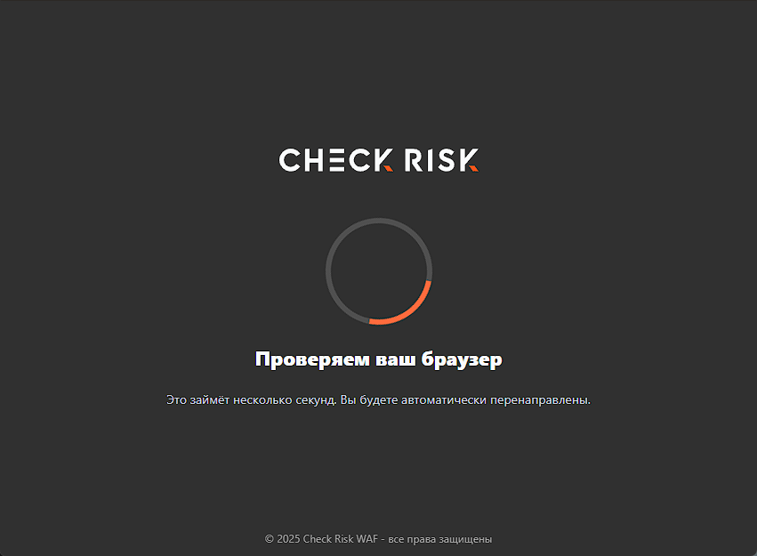
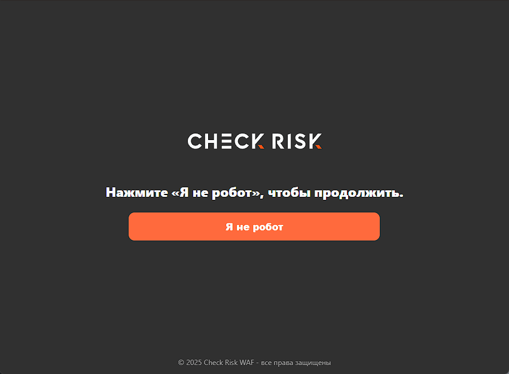
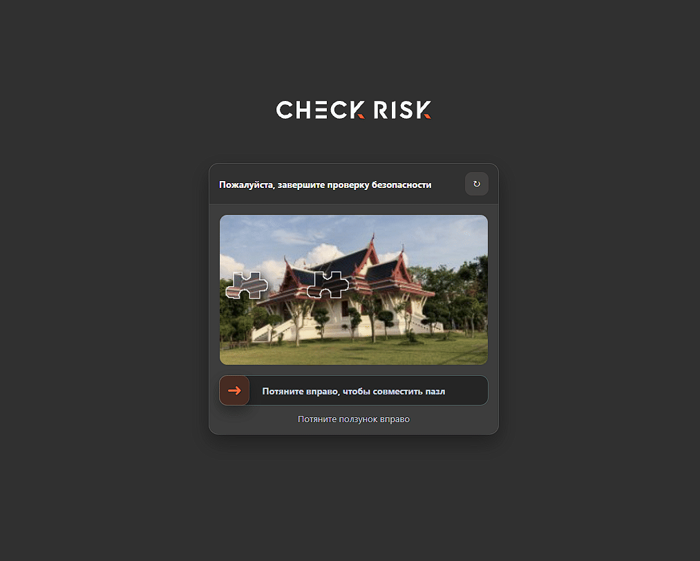
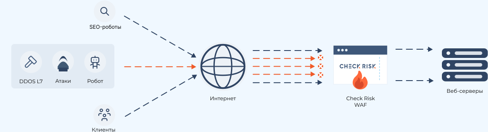

  

  <h1>Check Risk WAF</h1>

  
<strong>Российское комплексное облачное WAF-решение для защиты веб-приложений и инфраструктуры</strong>

  
<strong>Russian integrated cloud WAF solution for web application and infrastructure protection</strong>

  

    <a href="https://check-risk.ru/" target="_blank" rel="noopener noreferrer"><strong>Сайт</strong></a>
    ·
    <a href="https://check-risk.ru/docs" target="_blank" rel="noopener noreferrer"><strong>Документация</strong></a>
    ·
    <a href="#русская-версия"><strong>Русский</strong></a>
    ·
    <a href="#english-version"><strong>English</strong></a>
  

  

    
    
    
    
    
  

---

## Русская версия

**Check Risk WAF** – это Российское комплексное облачное решение WAF (Web Application Firewall), работающее на уровнях L3, L4, L7, предназначенное для защиты ваших приложений от **атак**, **уязвимостей**, **ботнет сетей**, **DOS/DDOS в одном решении**. Обеспечивает отказоустойчивость работы веб-приложений путем создания защитной отказоустойчивой сети **для каждого** клиента в **3-х разных ЦОД c SLA 99.95%**. Продукт имеет в себе **AI ассистента** для помощи и простоты работы пользователей в системе.

> Продукт **включен** в реестр Российского программного обеспечения Министерством цифрового развития РФ. Реестровая запись **№32239** **от 17.02.2026**

- [Презентация продукта](https://check-risk.ru/check-risk.ru_presentation.pdf)
- [Брошюра продукта](https://check-risk.ru/check-risk.ru_brochure.pdf)

### Скриншоты панели управления:

|  |  |
|---|---|
|  |  |
|  |  |

## Check Risk WAF состоит из 3-х основных модулей:

**WAF (межсетевой экран веб-приложений)** – осуществляет защиту веб-приложений, фильтрует и отслеживает HTTP/HTTPS трафик в режиме Reverse Proxy.

Модуль обеспечивает защиту от:

- **SQL Injection** - попытки внедрить SQL-код в параметры запроса, формы или URL, чтобы получить доступ к базе данных, изменить данные или обойти авторизацию.
- **XSS (Cross-Site Scripting )** - внедрение вредоносного JavaScript-кода на страницу, который может выполняться в браузере пользователя и использоваться для кражи cookies, токенов или данных сессии.
- **Code Injection** - попытки внедрить и выполнить произвольный программный код внутри приложения.
- **OS Command Injection** - выполнение системных команд на сервере через уязвимые параметры запроса.
- **CRLF Injection** - внедрение управляющих символов перевода строки, которое может использоваться для подмены HTTP-заголовков, HTTP response splitting или атак на логи.
- **LDAP Injection** - внедрение вредоносных LDAP-запросов для обхода аутентификации или получения данных из LDAP-каталогов.
- **XPath Injection** - атаки на XML/XPath-запросы, позволяющие получить несанкционированный доступ к данным.
- **RCE (Remote Code Execution** ) - попытки удалённого выполнения кода на сервере через уязвимости веб-приложения.
- **XXE, XML External Entity** - атаки на XML-парсеры, которые могут привести к чтению локальных файлов, SSRF или раскрытию конфиденциальных данных.
- **SSRF, Server-Side Request Forgery** - принуждение сервера выполнять запросы к внутренним или внешним ресурсам от имени приложения.
- **Path Traversal** - попытки получить доступ к файлам за пределами разрешённой директории, например через конструкции вида ../.
- **Backdoor Access** - попытки обращения к скрытым, вредоносным или несанкционированным точкам входа в приложение.
- **Brute Force** - массовые попытки подбора логина, пароля, токенов или других учётных данных.
- **СПА (система предотвращения атак) IP –** система автоматически обновляемой базы фидов опасных адресов, получаемых более чем из 30 бесплатных и коммерческих источников. Обновление базы данных происходит 1 раз в 1-у минуту.
- **СПА (система предотвращения атак) User Agent -** система автоматически обновляемой базы фидов опасных User Agent приложений, использующихся в атаках на сетевые ресурсы. Обновление базы данных происходит 1 раз в 1-у минуту.

**Антибот-защита** – осуществляет выявление, блокирование автоматизированных программ, защиту веб приложений от автоматизированных атак, ботнет сетей.

Модуль обеспечивает защиту от:

- **Vulnerability Scanning Bots** — автоматические сканеры, которые ищут уязвимые страницы, панели администрирования, устаревшие компоненты и открытые файлы.
- **Spam и Abuse в личных кабинетах** — массовая отправка сообщений, заявок, комментариев или других действий от имени пользователей.
- **Click Fraud** — накрутка кликов по рекламе, ссылкам, кнопкам или партнёрским программам.
- **Content Scraping** — копирование текстов, изображений, каталогов, цен и другого контента сайта.
- **Inventory Hoarding / Scalping** — автоматическое удержание товаров в корзине, массовый выкуп билетов, товаров или лимитированных предложений.
- **Form Spam** — автоматическая отправка спама через формы обратной связи, регистрации, комментариев или заявок.
- **HTTP Flood** — большое количество HTTP-запросов, направленных на перегрузку сайта, приложения или отдельных endpoint’ов.
- **Web Scraping** — автоматический сбор контента сайта, цен, карточек товаров, персональных данных или другой информации.
- **Account Takeover** — попытки захвата пользовательских аккаунтов с помощью автоматизированных входов, подбора данных или проверки украденных учётных записей.
- **Credential Stuffing** — массовые попытки входа с использованием ранее скомпрометированных пар логин/пароль.

Непосредственная реализация антибот защиты выполнена в 4-х вариациях, которые доступны каждому пользователю:

<table>
  <tr>
    <td width="50%">
      <strong>Автоматическая проверка</strong>  
      Проверка проходит без действий пользователя. Страница проверки запускает JavaScript, выполняет лёгкую браузерную проверку и получает проверочный cookie. Подходит для минимального влияния на обычных посетителей.
    </td>
    <td align="center" width="50%"></td>
  </tr>
  <tr>
    <td width="50%">
      <strong>Проверка действием (упрощённая)</strong>  
      Пользователь видит кнопку «Я не робот». После нажатия запускается такая же проверка браузера, как в автоматическом режиме, и при успехе выдаётся проверочный cookie. Подходит, когда нужно явное действие пользователя.
    </td>
    <td align="center" width="50%"></td>
  </tr>
  <tr>
    <td width="50%">
      <strong>Проверка действием (капча)</strong>  
      Пользователь проходит слайдер-пазл. Система выдаёт задание, пользователь двигает ползунок, а сервер проверяет правильность позиции. При успешном решении выдаётся проверочный cookie. Это самый строгий ручной режим проверки.
    </td>
    <td align="center" width="50%"></td>
  </tr>
  <tr>
    <td width="50%">
      <strong>Интеллектуальная проверка</strong>  
      Система сама выбирает уровень проверки по поведению посетителя: для доверенных пользователей показывает минимальную проверку, для сомнительных кнопку или пазл. Подходит как режим по умолчанию, когда нужен баланс между удобством и защитой.
    </td>
    <td align="center" width="50%"></td>
  </tr>
</table>

**Анти DOS/DDOS защита** – осуществляет выявление атак на уровнях L3, L4 направленных на перегрузку сервисов и нарушение их сетевой доступности. Модуль сохраняет доступность сервисов, снижает нагрузку на инфраструктуру, предотвращает простои в работе.

Модуль обеспечивает защиту от:

- **DoS-атаки** — попытки вывести сервис из строя с одного источника за счёт большого количества запросов или чрезмерного потребления ресурсов.
- **DDoS-атаки** — распределённые атаки с множества устройств или ботнетов, направленные на перегрузку канала, сервера, приложения или отдельных сервисов.
- **HTTP Flood** — массовая отправка HTTP/HTTPS-запросов к сайту, API или конкретным endpoint’ам для перегрузки приложения.
- **TCP Flood** — большое количество TCP-соединений, создающих нагрузку на сетевую инфраструктуру и серверные ресурсы.
- **UDP Flood** — массовый поток UDP-пакетов, направленный на перегрузку сетевого канала или оборудования.
- **SYN Flood** — атака на механизм установления TCP-соединений, при которой сервер перегружается множеством незавершённых подключений.
- **Slow HTTP Attacks** — атаки, при которых соединения удерживаются открытыми длительное время, постепенно исчерпывая ресурсы веб-сервера.
- **Application Layer DDoS** — атаки на прикладном уровне, направленные на ресурсоёмкие страницы, формы, поиск, авторизацию, корзину или API-методы.
- **Volumetric Attacks** — атаки большим объёмом трафика, цель которых — исчерпать пропускную способность канала связи.
- **Protocol Attacks** — атаки на сетевые протоколы и состояния соединений, которые перегружают балансировщики, межсетевые экраны и серверы.
- **Botnet Traffic** — вредоносный трафик от сетей заражённых устройств, используемых для массовых распределённых атак.
- **DNS Flood** — большое количество DNS-запросов, направленных на перегрузку DNS-инфраструктуры.
- **API Flood** — массовые запросы к API, способные вызвать деградацию сервиса, рост нагрузки на backend или отказ отдельных функций.
- **Resource Exhaustion** — попытки исчерпать ресурсы сервера: CPU, память, сетевые соединения, пул потоков, базу данных или лимиты приложения.

## Как работает Check Risk WAF:

  

    
  

Подключение защиты предусмотрено в 2-х режимах:

**Режим облачного управления** – данный тип подключения предусматривает делегирование управления DNS записями на ns сервера Check Risk WAF:

- **ns1.check-risk.ru**
- **ns2.check-risk.ru**
- **ns3.check-risk.ru**

При таком методе защиты система управляет A записями защищаемого домена или поддомена (ов), используя адреса из общего пула подсетей. Трафик в свою очередь перенаправляется в веб приложение с использованием Reverse Proxy, согласно заданным конфигурациям пользователем в личном кабинете. Такой метод защиты обеспечивает максимальную отказоустойчивости и адаптацию к мощным DDOS атакам.

**Режим выделенной инфраструктуры** – данный тип подключения предусматривает предоставления выделенной инфраструктуры пользователю от 3-х виртуальных машин в 3-х разных цод по выбору пользователя с SLA 99.95%. При таком методе защиты пользователю предоставляться 3 белых статичных IP v4 адреса. Пользователь указывает в A записи на своем NS сервере IP v4 адреса самостоятельно. Трафик в свою очередь перенаправляется в веб приложение с использованием Reverse Proxy, согласно заданным конфигурациям пользователем в личном кабинете.

## Перечень функциональных возможностей Check Risk WAF:

| Возможность | Описание |
|---|---|
| **Подключение веб-приложений под защиту WAF** | Создание и управление защищаемыми доменами и приложениями с привязкой портов, серверов назначения, SSL-сертификатов и индивидуальных настроек защиты. |
| **Подтверждение владения доменом** | Поддержка режимов защиты, мониторинга, работы без защиты, ожидания настройки и отключенного состояния. |
| **Уровни защиты** | Настройка интенсивности фильтрации от стандартного до максимального уровня глобально или отдельно для конкретного приложения. |
| **Проксирование и маршрутизация трафика** | Прием HTTP/HTTPS-трафика, проверка запросов и передача очищенного трафика на серверы приложения. |
| **Защита от типовых веб-атак** | Обнаружение и блокировка XSS, SQL-инъекций, атак включения файлов, удаленного выполнения кода, сканеров и протокольных аномалий. |
| **Пользовательские правила WAF** | Создание разрешающих, блокирующих и исключающих правил с условиями по IP, географии, приложению, URL, host, заголовкам, параметрам, телу запроса и HTTP-методу. |
| **Исключения и точная настройка срабатываний** | Настройка исключений для отдельных правил и сценариев, чтобы снижать ложные срабатывания без отключения защиты целиком. |
| **IP-группы и списки адресов** | Создание групп IP-адресов и сетей для дальнейшего использования в правилах разрешения, блокировки и исключений. |
| **Географическая фильтрация** | Использование страны клиента в правилах защиты и аналитике трафика. |
| **Anti-bot защита** | Проверка подозрительного автоматизированного трафика и отделение ботов от легитимных пользователей. |
| **Настройка доверенных ботов** | Управление обработкой проверенных ботов: разрешать всех, запрещать всех или разрешать только выбранный список. |
| **Условное применение anti-bot** | Включение anti-bot проверок только для заданных условий, например определенных URL, методов, параметров, заголовков или групп посетителей. |
| **Rate limiting и QPS-лимиты** | Ограничение интенсивности запросов, включая лимиты для приложения и лимиты на один клиентский IP. |
| **Настройка источника клиентского IP** | Выбор доверенного источника реального IP клиента и действия при недоверенной цепочке проксирования. |
| **TLS/SSL-настройки** | Управление SSL-протоколами, наборами шифров, HTTP/1, HTTP/2, принудительным HTTPS и HSTS. |
| **Загрузка пользовательских SSL-сертификатов** | Добавление собственных сертификатов и ключей с проверкой корректности, соответствия ключа сертификату и срока действия. |
| **Выпуск сертификатов Let's Encrypt** | Создание заявок на выпуск сертификатов для подтвержденных доменов с поддержкой автопродления. |
| **Управляемый DNS** | Создание и ведение DNS-зон для доменов, подключаемых к WAF, с проверкой делегирования и статуса зоны. |
| **Управление DNS-записями** | Создание, изменение и отключение основных типов DNS-записей, включая A, AAAA, CNAME, MX, NS, TXT, CAA, SRV и другие. |
| **Импорт и экспорт DNS-зон** | Импорт zone file, сравнение изменений, экспорт целевого состояния зоны и отслеживание статусов применения. |
| **Автосинхронизация WAF DNS-записей** | Автоматическое создание и обновление служебных DNS-записей, направляющих трафик домена через WAF. |
| **Публичные тестовые домены** | Предоставление тестового адреса для проверки прохождения трафика через WAF до переключения основного домена. |
| **Настройка HTTP-заголовков** | Добавление или удаление заголовков запросов и ответов для проксирования, совместимости и усиления безопасности. |
| **Поддержка прокси-заголовков** | Настройка передачи исходного протокола, host и цепочки клиентских IP при проксировании запроса. |
| **Сжатие ответов** | Включение сжатия ответов для повышения эффективности передачи данных. |
| **Поддержка SSE** | Поддержка потоковой передачи событий для приложений, которым нужны постоянные HTTP-соединения. |
| **Кастомные страницы ошибок** | Настройка текста и HTML-страниц для блокировок, превышения лимитов, ошибок шлюза, таймаута и anti-bot проверки. |
| **Журналирование событий** | Сбор журналов обычных запросов и событий безопасности с данными о домене, клиенте, запросе, статусе, сработавшем правиле и действии системы. |
| **Аналитика трафика и атак** | Агрегация показателей по запросам, посетителям, блокировкам, ошибкам, странам, страницам, источникам переходов, user-agent и IP-адресам. |
| **Дашборд WAF** | Отображение ключевых метрик защиты: запросов, посетителей, блокировок, ошибок, anti-bot проверок, нагрузки, топ IP, стран, страниц и статусов. |
| **Анализ атак и эпизодов** | Группировка связанных событий атак с указанием длительности, числа событий, уникальных IP и наличия блокировок. |
| **Просмотр деталей HTTP-запроса** | Переход от события атаки к деталям запроса, сообщениям правил, статусу ответа и действию системы. |
| **Создание правил из событий атак** | Формирование нового правила или исключения на основе конкретного события в журнале атак. |
| **AI-анализ атак** | Анализ выбранного события атаки, определение характера события и подготовка рекомендации или правила при ложном срабатывании. |
| **Интеграция с SIEM** | Передача событий запросов и безопасности во внешние системы мониторинга и корреляции событий. |
| **Глобальные и локальные настройки** | Настройка параметров защиты глобально для пользователя или индивидуально для отдельного приложения. |
| **Права субпользователей** | Разграничение доступа к сайтам и разделам WAF: статистике, атакам, правилам, IP-группам, DNS и настройкам. |
| **Тарифные лимиты и дополнительные QPS** | Учет тарифного плана, базового лимита производительности и дополнительных оплачиваемых QPS. |
| **Клиентские WAF-кластеры** | Поддержка выделенных кластеров для клиентов с отдельными параметрами эксплуатации и хранения данных. |

---

## English Version

**Check Risk WAF** is a Russian integrated cloud WAF (Web Application Firewall) solution operating at L3, L4, and L7 levels, designed to protect your applications from **attacks**, **vulnerabilities**, **botnet networks**, **DOS/DDOS in a single solution**. It ensures fault tolerance for web applications by creating a protective fault-tolerant network **for each** client across **3 different data centers with SLA 99.95%**. The product includes an **AI assistant** to help users and simplify their work in the system.

> The product is **included** in the Russian software registry by the Ministry of Digital Development of the Russian Federation. Registry entry **No. 32239** **dated 17.02.2026**

- [Product presentation](https://check-risk.ru/check-risk.ru_presentation.pdf)
- [Product brochure](https://check-risk.ru/check-risk.ru_brochure.pdf)

### Control panel screenshots:

|  |  |
|---|---|
|  |  |
|  |  |

## Check Risk WAF consists of 3 main modules:

**WAF (Web Application Firewall)** – protects web applications, filters and monitors HTTP/HTTPS traffic in Reverse Proxy mode.

The module provides protection against:

- **SQL Injection** - attempts to inject SQL code into request parameters, forms, or URLs to gain access to the database, modify data, or bypass authorization.
- **XSS (Cross-Site Scripting )** - injection of malicious JavaScript code into a page, which can be executed in the user’s browser and used to steal cookies, tokens, or session data.
- **Code Injection** - attempts to inject and execute arbitrary program code inside the application.
- **OS Command Injection** - execution of system commands on the server through vulnerable request parameters.
- **CRLF Injection** - injection of line-break control characters that can be used to spoof HTTP headers, perform HTTP response splitting, or attack logs.
- **LDAP Injection** - injection of malicious LDAP queries to bypass authentication or obtain data from LDAP directories.
- **XPath Injection** - attacks on XML/XPath queries that allow unauthorized access to data.
- **RCE (Remote Code Execution** ) - attempts to remotely execute code on the server through web application vulnerabilities.
- **XXE, XML External Entity** - attacks on XML parsers that can lead to reading local files, SSRF, or disclosure of confidential data.
- **SSRF, Server-Side Request Forgery** - forcing the server to make requests to internal or external resources on behalf of the application.
- **Path Traversal** - attempts to access files outside the allowed directory, for example through constructions such as ../.
- **Backdoor Access** - attempts to access hidden, malicious, or unauthorized entry points in the application.
- **Brute Force** - mass attempts to guess logins, passwords, tokens, or other credentials.
- **APS (attack prevention system) IP –** a system with an automatically updated feed database of dangerous addresses received from more than 30 free and commercial sources. The database is updated once every 1 minute.
- **APS (attack prevention system) User Agent -** a system with an automatically updated feed database of dangerous User Agent applications used in attacks on network resources. The database is updated once every 1 minute.

**Anti-bot protection** – detects and blocks automated programs, and protects web applications from automated attacks and botnet networks.

The module provides protection against:

- **Vulnerability Scanning Bots** — automated scanners that look for vulnerable pages, admin panels, outdated components, and exposed files.
- **Spam and Abuse in personal accounts** — mass sending of messages, requests, comments, or other actions on behalf of users.
- **Click Fraud** — artificial inflation of clicks on ads, links, buttons, or affiliate programs.
- **Content Scraping** — copying texts, images, catalogs, prices, and other website content.
- **Inventory Hoarding / Scalping** — automated holding of items in carts, mass purchasing of tickets, goods, or limited offers.
- **Form Spam** — automated spam submission through feedback, registration, comment, or request forms.
- **HTTP Flood** — a large number of HTTP requests aimed at overloading a website, application, or individual endpoints.
- **Web Scraping** — automated collection of website content, prices, product cards, personal data, or other information.
- **Account Takeover** — attempts to take over user accounts using automated logins, credential guessing, or checking stolen credentials.
- **Credential Stuffing** — mass login attempts using previously compromised login/password pairs.

The direct implementation of anti-bot protection is available in 4 variations, which are available to every user:

<table>
  <tr>
    <td width="50%">
      <strong>Automatic check</strong>  
      The check is performed without user action. The verification page runs JavaScript, performs a lightweight browser check, and receives a verification cookie. Suitable for minimal impact on regular visitors.
    </td>
    <td align="center" width="50%"></td>
  </tr>
  <tr>
    <td width="50%">
      <strong>Action-based check (simplified)</strong>  
      The user sees an “I am not a robot” button. After clicking, the same browser check as in automatic mode starts, and if successful, a verification cookie is issued. Suitable when an explicit user action is required.
    </td>
    <td align="center" width="50%"></td>
  </tr>
  <tr>
    <td width="50%">
      <strong>Action-based check (captcha)</strong>  
      The user completes a slider puzzle. The system issues a task, the user moves the slider, and the server verifies the correct position. After successful completion, a verification cookie is issued. This is the strictest manual verification mode.
    </td>
    <td align="center" width="50%"></td>
  </tr>
  <tr>
    <td width="50%">
      <strong>Intelligent check</strong>  
      The system chooses the verification level based on visitor behavior: trusted users receive a minimal check, while suspicious users see a button or puzzle. Suitable as the default mode when a balance between usability and protection is needed.
    </td>
    <td align="center" width="50%"></td>
  </tr>
</table>

**Anti DOS/DDOS protection** – detects attacks at L3 and L4 levels aimed at overloading services and disrupting network availability. The module preserves service availability, reduces infrastructure load, and prevents downtime.

The module provides protection against:

- **DoS attacks** — attempts to disable a service from a single source through a large number of requests or excessive resource consumption.
- **DDoS attacks** — distributed attacks from many devices or botnets aimed at overloading a channel, server, application, or individual services.
- **HTTP Flood** — mass sending of HTTP/HTTPS requests to a website, API, or specific endpoints to overload the application.
- **TCP Flood** — a large number of TCP connections that create load on network infrastructure and server resources.
- **UDP Flood** — a mass flow of UDP packets aimed at overloading a network channel or equipment.
- **SYN Flood** — an attack on the TCP connection establishment mechanism, where the server is overloaded by many unfinished connections.
- **Slow HTTP Attacks** — attacks in which connections are kept open for a long time, gradually exhausting web server resources.
- **Application Layer DDoS** — application-level attacks aimed at resource-intensive pages, forms, search, authorization, shopping cart, or API methods.
- **Volumetric Attacks** — attacks with a large volume of traffic, aimed at exhausting the bandwidth of a communication channel.
- **Protocol Attacks** — attacks on network protocols and connection states that overload load balancers, firewalls, and servers.
- **Botnet Traffic** — malicious traffic from networks of infected devices used for mass distributed attacks.
- **DNS Flood** — a large number of DNS requests aimed at overloading DNS infrastructure.
- **API Flood** — mass requests to an API that can cause service degradation, increased backend load, or failure of individual functions.
- **Resource Exhaustion** — attempts to exhaust server resources: CPU, memory, network connections, thread pool, database, or application limits.

## How Check Risk WAF works:

  

    
  

Protection can be connected in 2 modes:

**Cloud management mode** – this connection type provides delegation of DNS record management to Check Risk WAF ns servers:

- **ns1.check-risk.ru**
- **ns2.check-risk.ru**
- **ns3.check-risk.ru**

With this protection method, the system manages A records of the protected domain or subdomain(s) using addresses from the shared subnet pool. Traffic, in turn, is redirected to the web application using Reverse Proxy according to the user-defined configurations in the personal account. This protection method provides maximum fault tolerance and adaptation to powerful DDOS attacks.

**Dedicated infrastructure mode** – this connection type provides dedicated infrastructure to the user, starting from 3 virtual machines in 3 different data centers selected by the user with SLA 99.95%. With this protection method, the user receives 3 white static IPv4 addresses. The user independently points A records on their NS server to the IPv4 addresses. Traffic, in turn, is redirected to the web application using Reverse Proxy according to the user-defined configurations in the personal account.

## List of Check Risk WAF functional capabilities:

| Capability | Description |
|---|---|
| **Connecting web applications under WAF protection** | Creating and managing protected domains and applications with binding of ports, destination servers, SSL certificates, and individual protection settings. |
| **Domain ownership confirmation** | Support for protection, monitoring, no-protection operation, waiting-for-configuration, and disabled states. |
| **Protection levels** | Configuring filtering intensity from standard to maximum level globally or separately for a specific application. |
| **Traffic proxying and routing** | Receiving HTTP/HTTPS traffic, checking requests, and forwarding cleaned traffic to application servers. |
| **Protection against typical web attacks** | Detection and blocking of XSS, SQL injections, file inclusion attacks, remote code execution, scanners, and protocol anomalies. |
| **Custom WAF rules** | Creating allow, block, and exclude rules with conditions based on IP, geography, application, URL, host, headers, parameters, request body, and HTTP method. |
| **Exclusions and precise tuning of triggers** | Configuring exclusions for individual rules and scenarios to reduce false positives without disabling protection entirely. |
| **IP groups and address lists** | Creating groups of IP addresses and networks for later use in allow, block, and exclusion rules. |
| **Geographic filtering** | Using the client country in protection rules and traffic analytics. |
| **Anti-bot protection** | Checking suspicious automated traffic and separating bots from legitimate users. |
| **Trusted bot configuration** | Managing verified bot handling: allow all, block all, or allow only a selected list. |
| **Conditional anti-bot application** | Enabling anti-bot checks only for specified conditions, such as certain URLs, methods, parameters, headers, or visitor groups. |
| **Rate limiting and QPS limits** | Limiting request intensity, including limits for the application and limits per client IP. |
| **Client IP source configuration** | Selecting a trusted source of the real client IP and actions for an untrusted proxy chain. |
| **TLS/SSL settings** | Managing SSL protocols, cipher suites, HTTP/1, HTTP/2, forced HTTPS, and HSTS. |
| **Uploading custom SSL certificates** | Adding custom certificates and keys with verification of correctness, key-to-certificate matching, and expiration date. |
| **Issuing Let's Encrypt certificates** | Creating certificate issuance requests for confirmed domains with auto-renewal support. |
| **Managed DNS** | Creating and maintaining DNS zones for domains connected to WAF, with delegation and zone status checks. |
| **DNS record management** | Creating, modifying, and disabling main DNS record types, including A, AAAA, CNAME, MX, NS, TXT, CAA, SRV, and others. |
| **DNS zone import and export** | Importing a zone file, comparing changes, exporting the target zone state, and tracking application statuses. |
| **Automatic synchronization of WAF DNS records** | Automatically creating and updating service DNS records that route domain traffic through WAF. |
| **Public test domains** | Providing a test address to verify traffic passing through WAF before switching the primary domain. |
| **HTTP header configuration** | Adding or removing request and response headers for proxying, compatibility, and enhanced security. |
| **Proxy header support** | Configuring transmission of the original protocol, host, and client IP chain when proxying a request. |
| **Response compression** | Enabling response compression to improve data transfer efficiency. |
| **SSE support** | Supporting server-sent event streaming for applications that need persistent HTTP connections. |
| **Custom error pages** | Configuring text and HTML pages for blocks, limit exceedance, gateway errors, timeouts, and anti-bot checks. |
| **Event logging** | Collecting ordinary request logs and security events with data about the domain, client, request, status, triggered rule, and system action. |
| **Traffic and attack analytics** | Aggregating metrics by requests, visitors, blocks, errors, countries, pages, referrers, user-agent, and IP addresses. |
| **WAF dashboard** | Displaying key protection metrics: requests, visitors, blocks, errors, anti-bot checks, load, top IPs, countries, pages, and statuses. |
| **Attack and episode analysis** | Grouping related attack events with duration, event count, unique IP count, and block presence. |
| **Viewing HTTP request details** | Navigating from an attack event to request details, rule messages, response status, and system action. |
| **Creating rules from attack events** | Creating a new rule or exclusion based on a specific event in the attack log. |
| **AI attack analysis** | Analyzing a selected attack event, determining the nature of the event, and preparing a recommendation or rule in case of a false positive. |
| **SIEM integration** | Sending request and security events to external monitoring and event correlation systems. |
| **Global and local settings** | Configuring protection parameters globally for the user or individually for a separate application. |
| **Sub-user permissions** | Separating access to sites and WAF sections: statistics, attacks, rules, IP groups, DNS, and settings. |
| **Tariff limits and additional QPS** | Accounting for the tariff plan, base performance limit, and additionally paid QPS. |
| **Client WAF clusters** | Supporting dedicated clusters for clients with separate operating and data storage parameters. |
